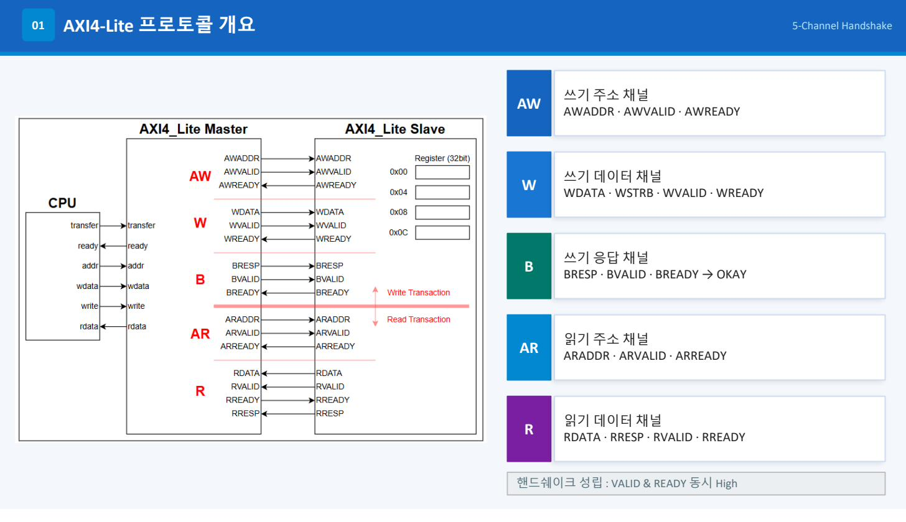
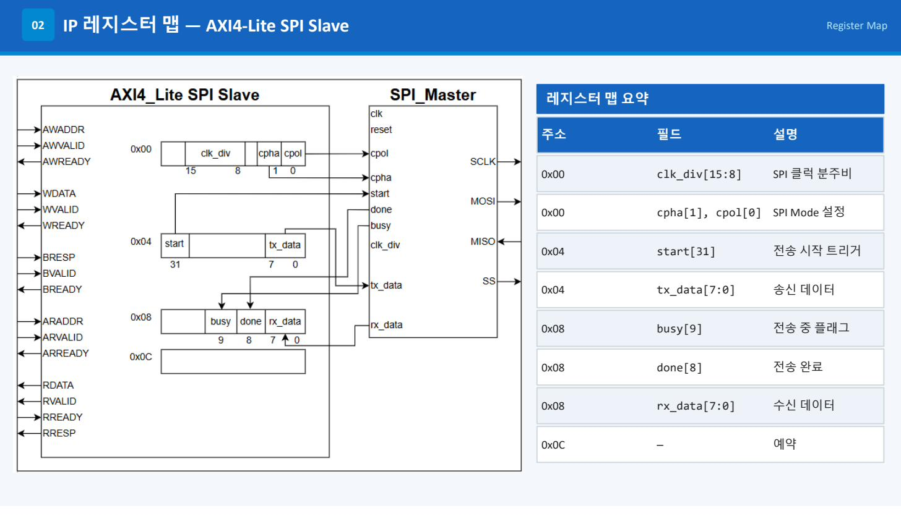
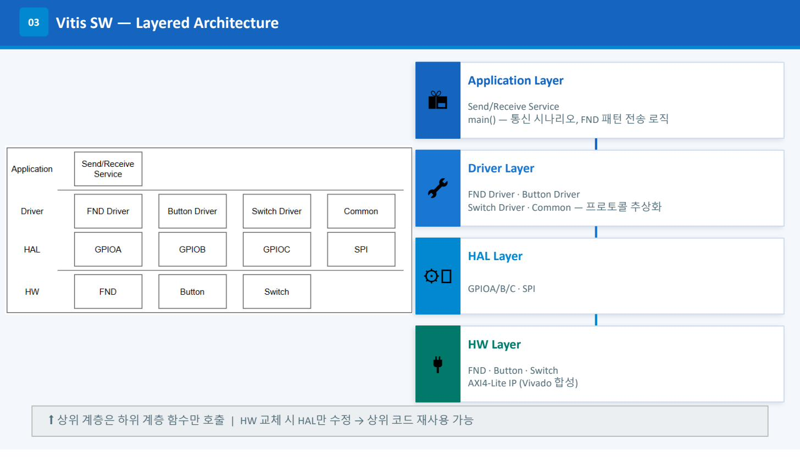
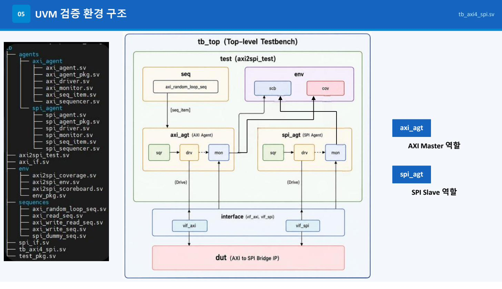
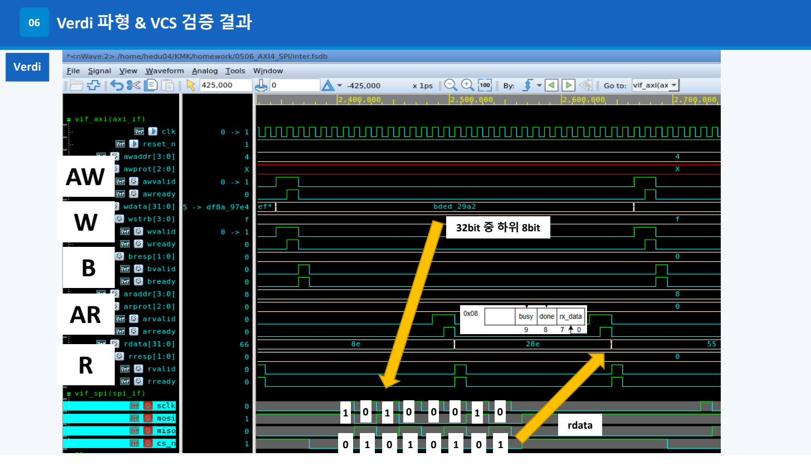
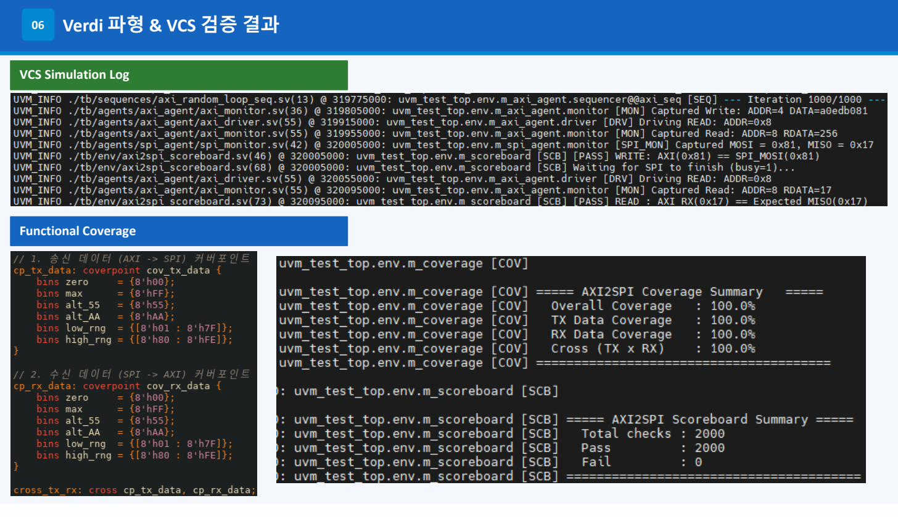
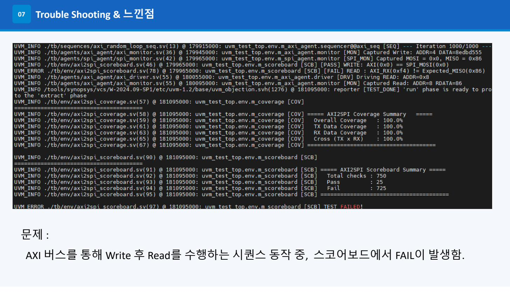
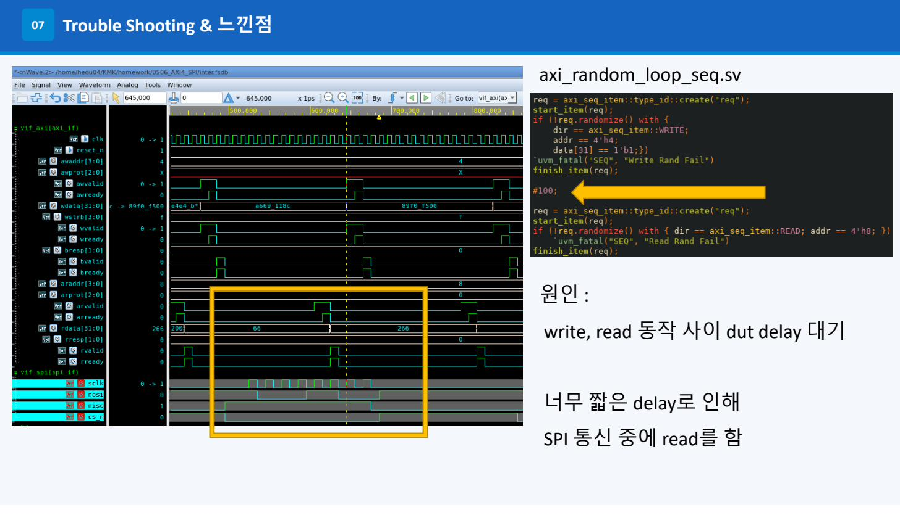
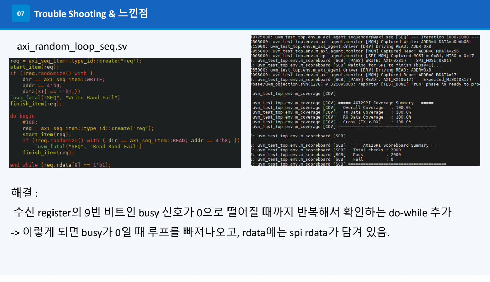
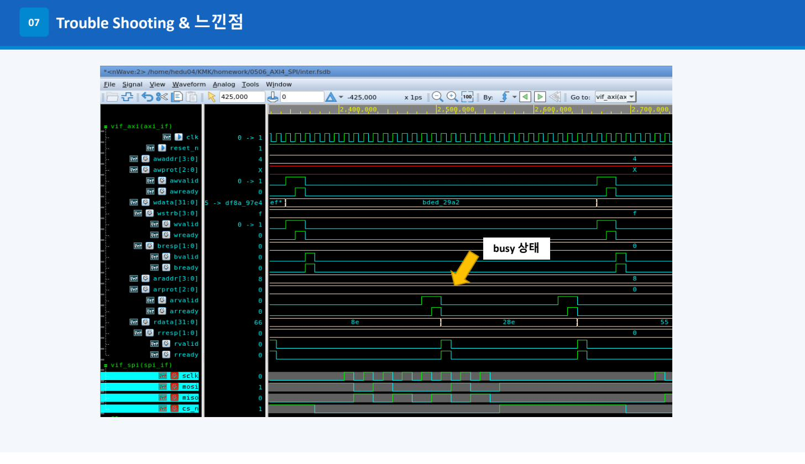

# AXI4-Lite SPI Master IP — UVM Functional Verification

> **RTL 설계 → UVM 검증 → 임베디드 C 드라이버** Full-Stack 구현  
> Platform: Digilent Basys3 (Xilinx Artix-7) · Tool: Vivado / Vitis / VCS / Verdi

<br>

## 📌 프로젝트 요약
[](docs/260508_SoC_AXI_Peripheral_MinkiKim.pdf)
AXI4-Lite 버스 인터페이스를 갖는 **SPI Master IP**를 직접 설계하고,  
**UVM 1.2** 검증 환경을 구축하여 1,000회 랜덤 시나리오 기반 기능 검증을 수행한 프로젝트입니다.

| 항목 | 내용 |
|------|------|
| **플랫폼** | Digilent Basys3 (Xilinx Artix-7 FPGA) |
| **설계 언어** | Verilog HDL (RTL), SystemVerilog (UVM TB) |
| **버스 인터페이스** | AXI4-Lite Slave |
| **통신 프로토콜** | SPI Master (Mode 0~3, CPOL/CPHA 런타임 설정) |
| **검증 방법론** | UVM 1.2 — Agent / Scoreboard / Coverage |
| **EDA 툴** | Synopsys VCS + Verdi, Xilinx Vivado + Vitis |
| **검증 결과** | Total 2000 checks — **Pass 2000 / Fail 0** · Coverage **100%** |

---

<br>

## 🗂️ 목차

1. [AXI4-Lite 프로토콜](#1-axi4-lite-프로토콜)
2. [IP 레지스터 맵](#2-ip-레지스터-맵)
3. [RTL 설계 상세](#3-rtl-설계-상세)
4. [SW Layered Architecture](#4-sw-layered-architecture)
5. [UVM 검증 환경](#5-uvm-검증-환경)
6. [Verdi 파형 & VCS 결과](#6-verdi-파형--vcs-결과)
7. [Trouble Shooting](#7-trouble-shooting)
8. [디렉토리 구조](#8-디렉토리-구조)
9. [시뮬레이션 실행](#9-시뮬레이션-실행)

---

<br>

## 1. AXI4-Lite 프로토콜

AXI4-Lite는 5개의 독립 채널로 구성되며, 각 채널은 **VALID & READY 동시 High** 조건으로 핸드쉐이크가 성립됩니다.



| 채널 | 방향 | 주요 신호 |
|------|------|-----------|
| **AW** | Master → Slave | AWADDR, AWVALID, AWREADY |
| **W** | Master → Slave | WDATA, WSTRB, WVALID, WREADY |
| **B** | Slave → Master | BRESP, BVALID, BREADY |
| **AR** | Master → Slave | ARADDR, ARVALID, ARREADY |
| **R** | Slave → Master | RDATA, RRESP, RVALID, RREADY |

---

<br>

## 2. IP 레지스터 맵



**Base Address**: `0x44A00000`

| Offset | 필드 | 비트 | 설명 |
|--------|------|------|------|
| `0x00` | clk_div | [15:8] | SPI 클럭 분주비 |
| `0x00` | cpha / cpol | [1:0] | SPI Mode 설정 (CPOL, CPHA) |
| `0x04` | start | [31] | 전송 시작 트리거 (Write 후 자동 클리어) |
| `0x04` | tx_data | [7:0] | 송신 데이터 |
| `0x08` | busy | [9] | 전송 중 플래그 |
| `0x08` | done | [8] | 전송 완료 플래그 |
| `0x08` | rx_data | [7:0] | 수신 데이터 |
| `0x0C` | — | — | 예약 |

> **설계 포인트**: `0x08`은 별도 레지스터를 두지 않고 읽기 시 `{22'd0, busy, done, rx_data}`를 즉석 조합하여 반환합니다. 전송 완료 직후 지연 없이 상태가 반영됩니다.

---

<br>

## 3. RTL 설계 상세

### 모듈 계층 구조

```
SPI_Master_v1_0                  ← Top-level AXI IP Wrapper
├── SPI_Master_v1_0_S00_AXI      ← AXI4-Lite Slave 컨트롤러
│   ├── slv_reg0 [0x00]          ← CPOL, CPHA, CLK_DIV 저장
│   ├── slv_reg1 [0x04]          ← TX 데이터, START 비트
│   └── read mux [0x08]          ← {busy, done, rx_data} 즉석 조합 (레지스터 없음)
└── spi_master                   ← SPI 프로토콜 FSM 코어
    ├── Clock Divider             ← half_tick 생성 (clk_div 기반)
    └── FSM                      ← IDLE → START → DATA → STOP
```

### SPI Master FSM

```
      reset
        │
        ▼
 ┌─────────────┐  start=1  ┌─────────────┐
 │    IDLE     │ ─────────►│    START    │
 │  cs_n = 1   │           │  cs_n = 0   │
 │  sclk = cpol│           │  MOSI 선출력│
 └─────────────┘           └──────┬──────┘
        ▲                         │
        │                         ▼
 ┌─────────────┐ bit_cnt==7 ┌─────────────┐
 │    STOP     │ ◄──────────│    DATA     │
 │  cs_n = 1   │            │  8비트 시프트│
 │  done = 1   │            │  half_tick  │
 │  busy = 0   │            │  MOSI/MISO  │
 └─────────────┘            └─────────────┘
```

### CPOL / CPHA 지원

| Mode | CPOL | CPHA | SCLK 유휴 | 샘플링 엣지 |
|------|------|------|----------|------------|
| 0 | 0 | 0 | LOW | Rising |
| 1 | 0 | 1 | LOW | Falling |
| 2 | 1 | 0 | HIGH | Falling |
| 3 | 1 | 1 | HIGH | Rising |

### 핵심 설계 결정

**① START 비트 자동 클리어**
```verilog
// 쓰기가 없는 평상시에 START 비트(bit31)를 자동으로 0으로 내림
end else begin
    slv_reg1[31] <= 1'b0;
end
```
→ 소프트웨어에서 `TX_DATA = (1<<31) | data` 한 번 쓰기만으로 SPI 전송이 시작됩니다.

**② slv_reg2 제거 — 읽기 전용 동적 조합**
```verilog
2'h2 : reg_data_out <= {22'd0, busy, done, rx_data};
```
→ 레지스터 1개 절약 + 전송 완료 즉시 상태 반영 (FF 지연 없음).

---

<br>

## 4. SW Layered Architecture



HW 교체 시 HAL 계층만 수정하면 상위 코드를 그대로 재사용할 수 있는 구조입니다.

```
Application Layer  │  spi_ap.c  — 버튼 이벤트 감지, FND 표시 시나리오
───────────────────┤
Driver Layer       │  FND / Button / Switch Driver
───────────────────┤
HAL Layer          │  GPIOA/B/C · SPI  (레지스터 구조체 매핑)
───────────────────┤
HW Layer           │  FND · Button · Switch · AXI4-Lite IP (Vivado 합성)
```

**SPI HAL 구조체 매핑**

```c
typedef struct {
    volatile uint32_t CTRL;      // 0x00: CPOL[0], CPHA[1], CLK_DIV[15:8]
    volatile uint32_t TX_DATA;   // 0x04: START[31], TX_DATA[7:0]
    volatile uint32_t STATUS_RX; // 0x08: BUSY[9], DONE[8], RX_DATA[7:0]
} SPI_Typedef_t;

#define SPI_BASE_ADDR 0x44A00000
#define SPI_PORT ((SPI_Typedef_t *) SPI_BASE_ADDR)
```

**SPI Transfer**

```c
uint8_t SPI_Transfer(uint8_t tx_data) {
    SPI_PORT->TX_DATA = (1U << 31) | tx_data;  // START + TX 동시 쓰기
    SPI_PORT->TX_DATA = tx_data;               // START 비트 즉시 해제
    while (SPI_PORT->STATUS_RX & (1 << 9));    // busy 폴링
    return (uint8_t)(SPI_PORT->STATUS_RX & 0xFF);
}
```

---

<br>

## 5. UVM 검증 환경



### 계층 구조 요약

```
tb_axi4_spi.sv  (Top Testbench)
│  clk / reset_n 생성
│  axi_if (vif_axi) + spi_if (vif_spi) 인스턴스화
│  DUT: SPI_Master_v1_0 핀 연결
│
└─ axi2spi_test
   └─ axi2spi_env
      ├─ axi2spi_scoreboard  ← WRITE/READ E2E 자동 비교
      ├─ axi2spi_coverage    ← TX/RX 크로스 커버리지
      ├─ axi_agent (ACTIVE)
      │   ├─ axi_driver      ← drive_write() / drive_read()
      │   └─ axi_monitor     ← Write/Read 트랜잭션 캡처
      └─ spi_agent (ACTIVE)
          ├─ spi_driver      ← MISO 랜덤 자동 응답
          └─ spi_monitor     ← MOSI/MISO 8비트 캡처
```

### 시퀀스 라이브러리

| 시퀀스 | 용도 |
|--------|------|
| `axi_write_seq` | 단일 AXI Write |
| `axi_read_seq` | 단일 AXI Read |
| `axi_write_read_seq` | Write → Read E2E |
| `axi_random_loop_seq` | 1,000회 랜덤 반복 (메인 시나리오) |
| `spi_dummy_seq` | SPI 슬레이브 역할 — 랜덤 MISO 응답 |

### 스코어보드 검증 로직

```systemverilog
// WRITE 검증: AXI가 보낸 데이터 == SPI MOSI 핀 출력
if (a_item.data[7:0] == s_item.mosi_data)
    pass_cnt++;
else
    `uvm_error("SCB", "[FAIL] WRITE mismatch")

// READ 검증: AXI가 읽은 데이터 == SPI MISO로 쏜 데이터
if (a_item.rdata[7:0] == expected_rdata)
    pass_cnt++;
else
    `uvm_error("SCB", "[FAIL] READ mismatch")
```

### 커버리지 설계

```systemverilog
covergroup cg_axi2spi;
    cp_tx_data: coverpoint cov_tx_data {
        bins zero     = {8'h00};          // 경계값
        bins max      = {8'hFF};          // 경계값
        bins alt_55   = {8'h55};          // 체커보드 패턴
        bins alt_AA   = {8'hAA};          // 체커보드 반전
        bins low_rng  = {[8'h01:8'h7F]};
        bins high_rng = {[8'h80:8'hFE]};
    }
    cp_rx_data: coverpoint cov_rx_data { /* 동일 */ }
    cross_tx_rx: cross cp_tx_data, cp_rx_data;  // 6×6 = 36 bins
endgroup
```

---

<br>

## 6. Verdi 파형 & VCS 결과

### Verdi 파형 — AXI + SPI 동시 관측



AW / W / B (Write), AR / R (Read) 채널 핸드쉐이크와  
SPI SCLK / MOSI / MISO / CS_N 신호를 한 화면에서 확인합니다.

### VCS Simulation Log & Functional Coverage



```
===== AXI2SPI Scoreboard Summary =====
  Total checks : 2000
  Pass         : 2000
  Fail         : 0
TEST PASSED!

===== AXI2SPI Coverage Summary =====
  Overall Coverage   : 100.0%
  TX Data Coverage   : 100.0%
  RX Data Coverage   : 100.0%
  Cross (TX x RX)    : 100.0%
```

---

<br>

## 7. Trouble Shooting

### 문제 — Scoreboard FAIL 발생



Write 후 Read를 수행하는 시퀀스 동작 중, 스코어보드에서 FAIL이 발생했습니다.  
(Total 750 checks — Pass 25 / **Fail 725**)

### 원인 — Delay 부족으로 SPI 전송 중 Read 시도



Write와 Read 사이에 고정 `#100` delay만 삽입했는데,  
SPI 통신이 완료되기 전에 Read가 발생하여 아직 갱신되지 않은 rx_data를 읽었습니다.

### 해결 — busy 폴링 do-while 추가



```systemverilog
// 수정 전: 고정 delay
#100;

// 수정 후: busy 비트가 0이 될 때까지 반복 폴링
do begin
    #100;
    req = axi_seq_item::type_id::create("req");
    start_item(req);
    if (!req.randomize() with { dir == axi_seq_item::READ; addr == 4'h8; })
        `uvm_fatal("SEQ", "Read Rand Fail")
    finish_item(req);
end while (req.rdata[9] == 1'b1);  // bit[9] = busy
```

### busy 신호 파형 확인



do-while 적용 후 busy=1 구간을 정확히 기다렸다가 Read를 수행하여  
**Pass 2000 / Fail 0** 달성.

---

<br>

## 8. 디렉토리 구조

```
axi-spi-uvm-verification/
│
├── rtl/                                  # RTL 설계
│   ├── SPI_Master_v1_0.v                 # Top-level AXI IP + spi_master FSM
│   └── SPI_Master_v1_0_S00_AXI.v        # AXI4-Lite Slave 컨트롤러
│
├── tb/                                   # UVM 검증 환경
│   ├── tb_axi4_spi.sv                    # Top Testbench (DUT/IF 인스턴스화, clk/rst)
│   ├── axi_if.sv                         # AXI4-Lite 버추얼 인터페이스
│   ├── spi_if.sv                         # SPI 버추얼 인터페이스
│   ├── test_pkg.sv                       # 테스트 패키지 (조립)
│   ├── axi2spi_test.sv                   # UVM Test 클래스
│   │
│   ├── agents/
│   │   ├── axi_agent/
│   │   │   ├── axi_agent_pkg.sv
│   │   │   ├── axi_seq_item.sv           # 제약: addr∈{0,4,8,C}, data[31]=1
│   │   │   ├── axi_sequencer.sv
│   │   │   ├── axi_driver.sv             # drive_write() / drive_read()
│   │   │   ├── axi_monitor.sv            # W/R 트랜잭션 캡처 → ap.write()
│   │   │   └── axi_agent.sv
│   │   └── spi_agent/
│   │       ├── spi_agent_pkg.sv
│   │       ├── spi_seq_item.sv           # miso_data 랜덤화
│   │       ├── spi_sequencer.sv
│   │       ├── spi_driver.sv             # negedge sclk 기준 MISO 공급
│   │       ├── spi_monitor.sv            # posedge sclk 기준 MOSI/MISO 캡처
│   │       └── spi_agent.sv
│   │
│   ├── env/
│   │   ├── env_pkg.sv
│   │   ├── axi2spi_env.sv               # 에이전트 + 스코어보드 연결
│   │   ├── axi2spi_scoreboard.sv        # TLM FIFO 기반 E2E 자동 비교
│   │   └── axi2spi_coverage.sv          # TX/RX 크로스 커버그룹
│   │
│   └── sequences/
│       ├── axi_write_seq.sv
│       ├── axi_read_seq.sv
│       ├── axi_write_read_seq.sv
│       ├── axi_random_loop_seq.sv        # 메인 시나리오: 1000회 랜덤
│       └── spi_dummy_seq.sv              # SPI 슬레이브 역할 (forever loop)
│
├── sw/                                   # 임베디드 C 드라이버
│   ├── HAL/
│   │   ├── SPI/
│   │   │   ├── SPI.h                    # 레지스터 구조체 매핑
│   │   │   └── SPI.c                    # SPI_Init(), SPI_Transfer()
│   │   └── GPIO/
│   │       ├── GPIO.h
│   │       └── GPIO.c
│   ├── driver/
│   │   ├── Button/                      # 디바운싱 드라이버
│   │   ├── Switch/                      # DIP 스위치 드라이버
│   │   └── FND/                         # 7-Segment 멀티플렉싱 드라이버
│   ├── ap/
│   │   └── spi_ap/
│   │       ├── spi_ap.h
│   │       └── spi_ap.c                 # 버튼→SPI전송→FND표시 시나리오
│   ├── common/
│   │   ├── common.h
│   │   └── common.c                     # delay_ms / delay_us
│   └── main.c
│
├── docs/
│   └── images/                          # README 삽입 이미지
│   │   ├── axi4_lite_protocol.jpeg
│   │   ├── spi_register_map.jpeg
│   │   ├── sw_layered_architecture.jpeg
│   │   ├── uvm_env_structure.jpeg
│   │   ├── verdi_waveform.jpeg
│   │   ├── vcs_result_coverage.jpeg
│   │   ├── ts_problem.jpeg
│   │   ├── ts_cause_waveform.jpeg
│   │   ├── ts_fix_result.jpeg
│   │   └── ts_busy_waveform.jpeg
│   └── 260508_SoC_AXI_Peripheral_MinkiKim.pdf
│
├── filelist.f                            # VCS 컴파일 파일 목록
└── Makefile                              # 빌드 자동화
```

---

<br>

## 9. 시뮬레이션 실행

### 사전 요구사항

- Synopsys VCS (UVM 1.2 포함)
- Synopsys Verdi (선택, 파형 뷰어)

### 실행 명령

```bash
make sim        # 컴파일 + 시뮬레이션 (기본)
make compile    # 컴파일만
make verdi      # 시뮬레이션 + Verdi 파형 뷰어
make vw         # FSDB 파형만 확인
make vc         # VCS 코드 커버리지 리포트
make clean      # 빌드 결과물 정리
```

### 시드 고정 재현

```bash
make sim SEED=42
```

### 커버리지 수집 옵션 (Makefile)

```makefile
-cm line+cond+fsm+tgl+branch+assert
-cm_dir coverage.vdb
```

---

<br>

## 🛠️ 기술 스택

| 분류 | 기술 |
|------|------|
| **HW 설계** | Verilog HDL, AXI4-Lite, SPI Protocol, FSM |
| **검증** | UVM 1.2 (SystemVerilog), Functional Coverage, Code Coverage |
| **EDA** | Synopsys VCS, Synopsys Verdi, Xilinx Vivado, Xilinx Vitis |
| **임베디드 SW** | C (Bare-metal), Memory-Mapped I/O, HAL 설계 패턴 |
| **플랫폼** | Digilent Basys3, Xilinx Artix-7 |

---

<br>

## 👤 작성자

**김민기** · SoC 설계 / 검증 엔지니어 지망  
KCCS ISTC 교육과정 (2026.05)
